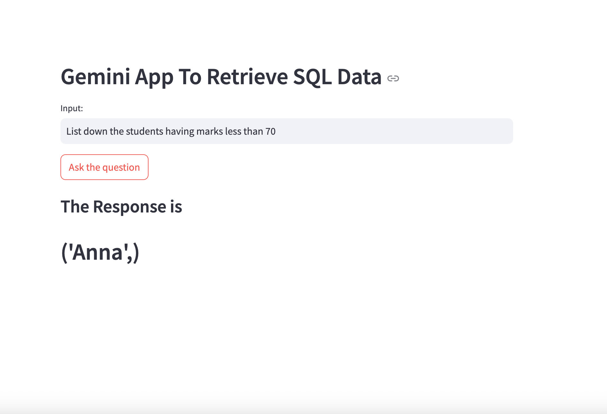

# Gemini App To Retrieve SQL Data
## Overview
This application allows users to input questions in natural language, and it generates and executes corresponding SQL queries on a pre-defined database. The app uses Google Gemini's Generative AI to convert questions to SQL commands.

## Features
- Input a question in natural language.
- Generate an SQL query using Google Gemini's Generative AI.
- Execute the SQL query on a local SQLite database.
- Display the results of the SQL query on the Streamlit app.

## Requirements
- Python 3.10 or higher
- Streamlit
- dotenv
- sqlite3
- google-generativeai

## Installation
- Clone the repository: git clone git@github.com:SaritaPhD/End-to-End-Text-to-SQL-LLM-App-Along-With-Quering-SQL-Database.git
- cd End-to-End-Text-to-SQL-LLM-App-Along-With-Quering-SQL-Database
- Create and activate a virtual environment: python3 -m venv venv
- source venv/bin/activate
- Install the required packages: pip install -r requirements.txt
- Create a .env file in the project root directory and add your Google API key: GOOGLE_API_KEY=your_google_api_key

## Usage
Ensure you have a SQLite database named database.db in the project directory with a table STUDENT containing columns NAME, CLASS, and SECTION.
- You can get this databse by running the following command: python3 sqlite.py

- Once database is created then run the below given command:

- Run the Streamlit app: streamlit run app.py

- Open your web browser and navigate to the URL provided by Streamlit (usually http://localhost:8501).

- Input your question in the text input field and click the "Ask the question" button.

## License
This project is licensed under the MIT License.

## Acknowledgements
Streamlit
Google Generative AI
dotenv
SQLite

